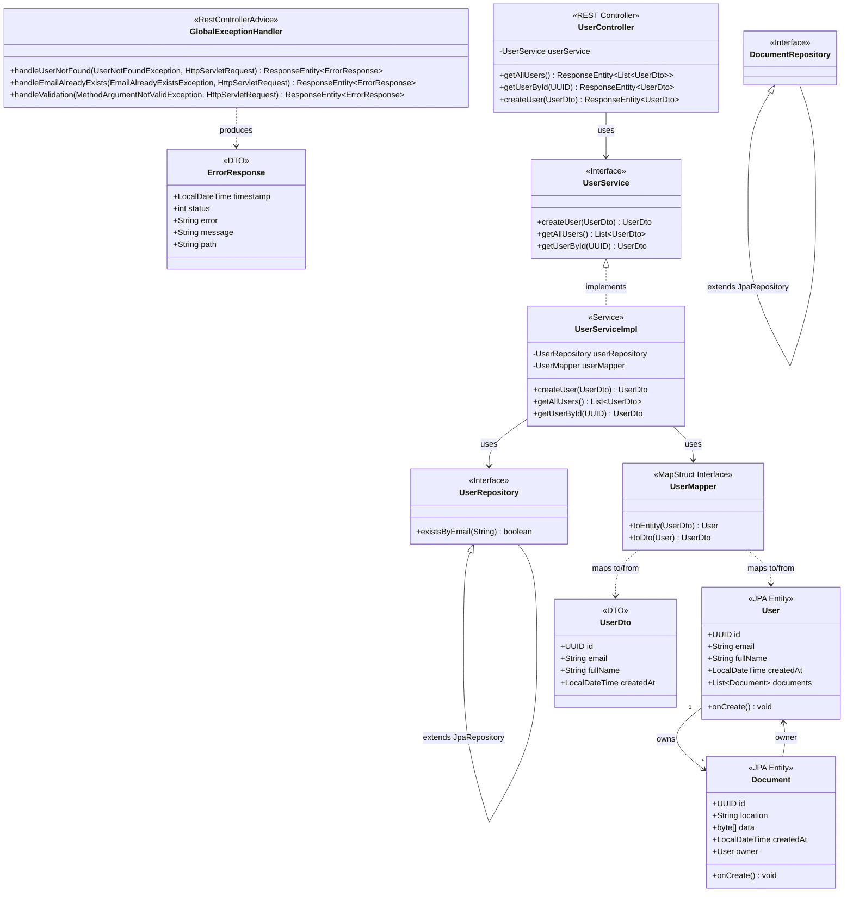
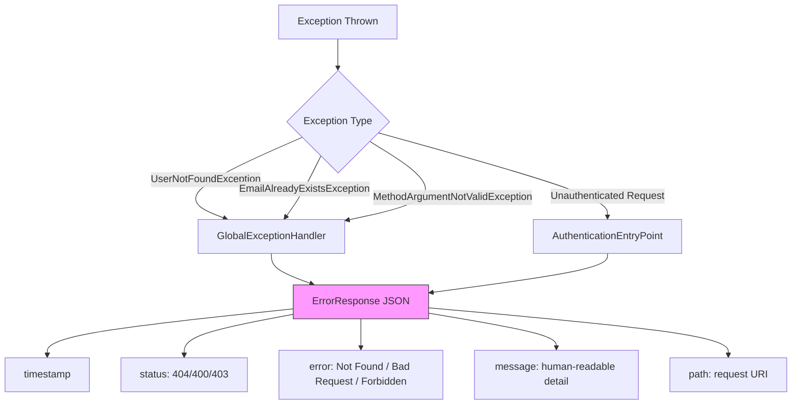

# Domain Model & Class Diagrams

## Entity Relationships



## DTO Mapping Rules

```mermaid
flowchart LR
    subgraph "UserDto"
        direction LR
        UId[id - READ_ONLY]
        UEmail[email - @Email @NotBlank]
        UName[fullName - @NotBlank @Size max=100]
        UCreated[createdAt - READ_ONLY]
    end

    subgraph "User Entity"
        direction LR
        EId[id - Generated UUID]
        EEmail[email - unique not null]
        EName[fullName - not null max=100]
        ECreated[createdAt - PrePersist]
        EDocs[documents - OneToMany]
    end

    UId -->|@Mapping ignore=true| EId
    UEmail --> EEmail
    UName --> EName
    UCreated -->|@Mapping ignore=true| ECreated
    EDocs -->|@Mapping ignore=true| UDocs

    style UId fill:#ff9,stroke:#333
    style UCreated fill:#ff9,stroke:#333
```

## Exception Handling Chain


