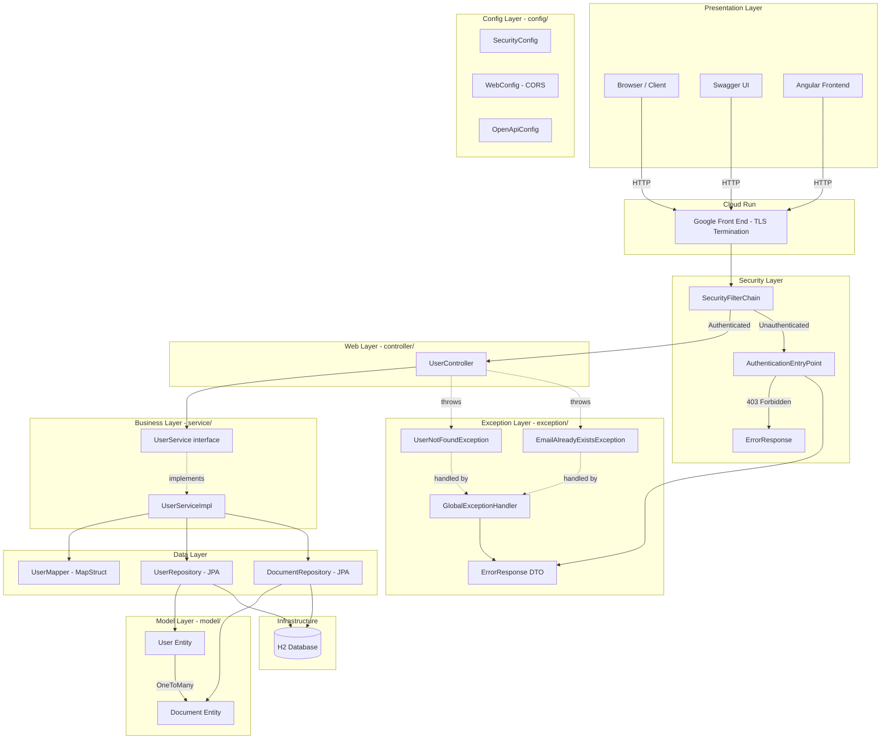
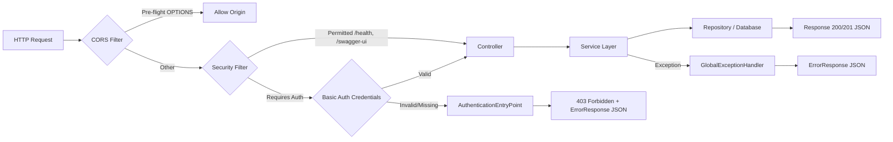
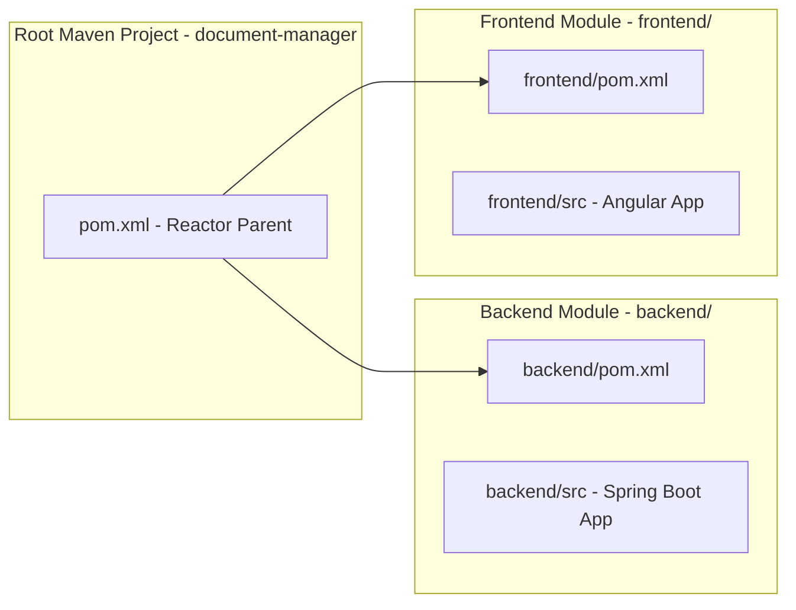

# Component Architecture

## Layered Package Structure

```mermaid
graph TB
    subgraph "Presentation Layer"
        Browser[Browser / Client]
        Swagger[Swagger UI]
        Angular[Angular Frontend]
    end

    subgraph "Cloud Run"
        Proxy[Google Front End - TLS Termination]
    end

    subgraph "Security Layer"
        SecurityFilter[SecurityFilterChain]
        EntryPoint[AuthenticationEntryPoint]
        EntryPoint -->|403 Forbidden| ErrorResp[ErrorResponse]
    end

    subgraph "Web Layer - controller/"
        UserController[UserController]
    end

    subgraph "Business Layer - service/"
        UserServiceIface[UserService interface]
        UserServiceImpl[UserServiceImpl]
    end

    subgraph "Data Layer"
        UserMapper[UserMapper - MapStruct]
        UserRepository[UserRepository - JPA]
        DocumentRepository[DocumentRepository - JPA]
    end

    subgraph "Model Layer - model/"
        UserEntity[User Entity]
        DocumentEntity[Document Entity]
    end

    subgraph "Exception Layer - exception/"
        GlobalHandler[GlobalExceptionHandler]
        ErrResp[ErrorResponse DTO]
        UserNotFound[UserNotFoundException]
        EmailExists[EmailAlreadyExistsException]
    end

    subgraph "Config Layer - config/"
        SecurityCfg[SecurityConfig]
        WebCfg[WebConfig - CORS]
        OpenApiCfg[OpenApiConfig]
    end

    subgraph "Infrastructure"
        H2[(H2 Database)]
    end

    Browser -->|HTTP| Proxy
    Swagger -->|HTTP| Proxy
    Angular -->|HTTP| Proxy
    Proxy --> SecurityFilter

    SecurityFilter -->|Authenticated| UserController
    SecurityFilter -->|Unauthenticated| EntryPoint

    UserController --> UserServiceIface
    UserServiceIface -.->|implements| UserServiceImpl
    UserServiceImpl --> UserMapper
    UserServiceImpl --> UserRepository
    UserServiceImpl --> DocumentRepository

    UserRepository --> UserEntity
    DocumentRepository --> DocumentEntity

    UserEntity -->|OneToMany| DocumentEntity

    UserController -.->|throws| UserNotFound
    UserController -.->|throws| EmailExists
    UserNotFound -.->|handled by| GlobalHandler
    EmailExists -.->|handled by| GlobalHandler
    GlobalHandler --> ErrResp
    EntryPoint --> ErrResp

    UserRepository --> H2
    DocumentRepository --> H2
```

## Request Lifecycle

```mermaid
flowchart LR
    A[HTTP Request] --> B{CORS Filter}
    B -->|Pre-flight OPTIONS| C[Allow Origin]
    B -->|Other| D{Security Filter}
    D -->|Permitted /health, /swagger-ui| E[Controller]
    D -->|Requires Auth| F{Basic Auth Credentials}
    F -->|Valid| E
    F -->|Invalid/Missing| G[AuthenticationEntryPoint]
    G --> H[403 Forbidden + ErrorResponse JSON]
    E --> I[Service Layer]
    I --> J[Repository / Database]
    I -->|Exception| K[GlobalExceptionHandler]
    K --> L[ErrorResponse JSON]
    J --> M[Response 200/201 JSON]
```

## Module Structure

```mermaid
graph LR
    subgraph "Root Maven Project - document-manager"
        RootPom[pom.xml - Reactor Parent]
    end

    subgraph "Backend Module - backend/"
        BPom[backend/pom.xml]
        BSrc[backend/src - Spring Boot App]
    end

    subgraph "Frontend Module - frontend/"
        FPom[frontend/pom.xml]
        FSrc[frontend/src - Angular App]
    end

    RootPom --> BPom
    RootPom --> FPom
```
