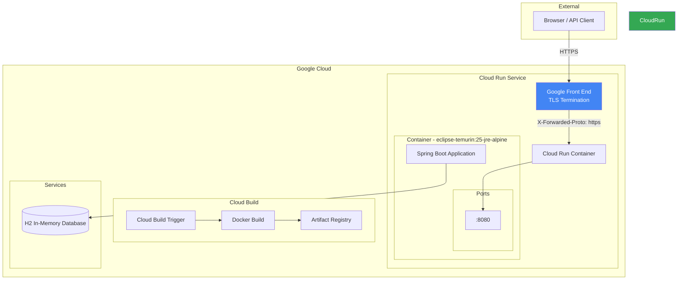
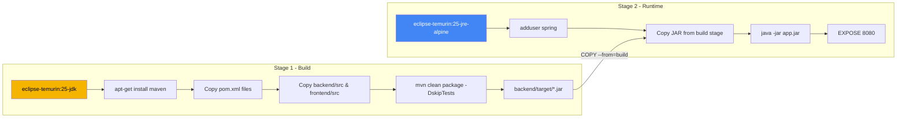
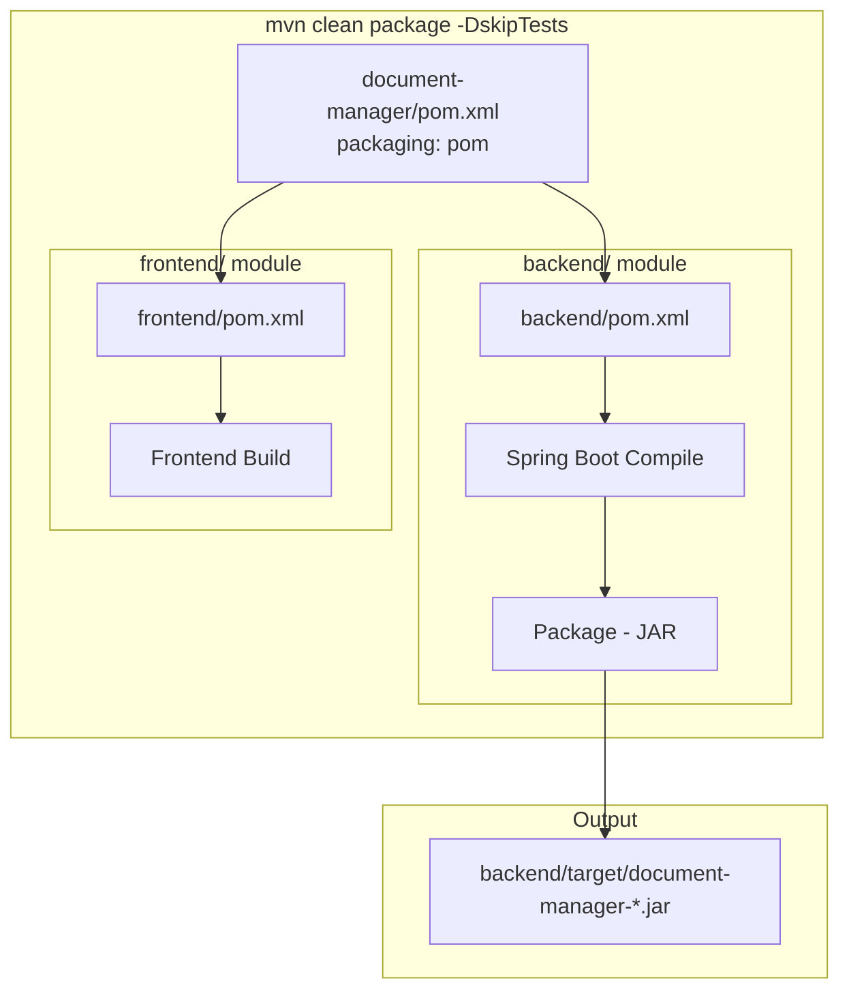
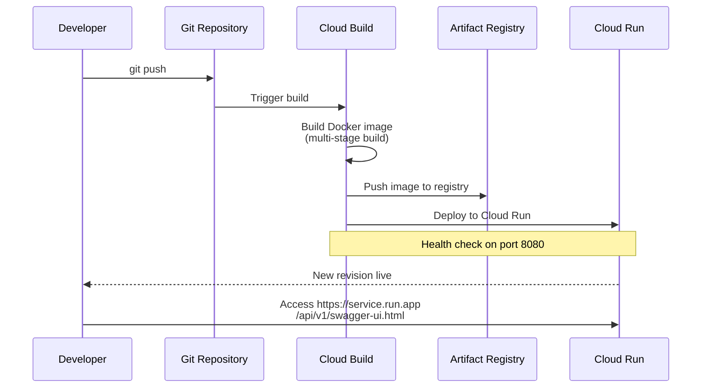
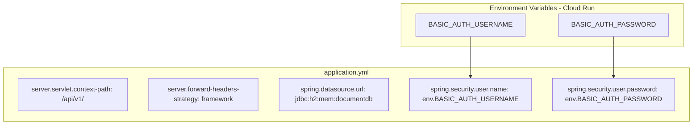

# Deployment Architecture

## Cloud Run Architecture

```mermaid
graph TB
    subgraph "Google Cloud"
        subgraph "Cloud Run Service"
            GFE[Google Front End<br/>TLS Termination]
            Proxy[Cloud Run Container]

            subgraph "Container - eclipse-temurin:25-jre-alpine"
                SpringBoot[Spring Boot Application]
                subgraph "Ports"
                    Port8080[":8080"]
                end
            end

            GFE -->|X-Forwarded-Proto: https| Proxy
            Proxy --> Port8080
        end

        subgraph "Cloud Build"
            Trigger[Cloud Build Trigger]
            Docker[Docker Build]
            Registry[Artifact Registry]
            Trigger --> Docker --> Registry
        end

        subgraph "Services"
            H2[(H2 In-Memory Database)]
        end
    end

    subgraph "External"
        Client[Browser / API Client]
    end

    Client -->|HTTPS| GFE
    SpringBoot --> H2

    style GFE fill:#4285F4,color:#fff
    style CloudRun fill:#34A853,color:#fff
```

## Docker Multi-Stage Build

```mermaid
flowchart LR
    subgraph "Stage 1 - Build"
        direction TB
        Base1[eclipse-temurin:25-jdk]
        AptMaven[apt-get install maven]
        CopyPom[Copy pom.xml files]
        CopySrc[Copy backend/src & frontend/src]
        MvnBuild[mvn clean package -DskipTests]
        JAR[backend/target/*.jar]

        Base1 --> AptMaven --> CopyPom --> CopySrc --> MvnBuild --> JAR
    end

    subgraph "Stage 2 - Runtime"
        direction TB
        Base2[eclipse-temurin:25-jre-alpine]
        User[adduser spring]
        CopyJar[Copy JAR from build stage]
        Entry[java -jar app.jar]
        Expose[EXPOSE 8080]

        Base2 --> User --> CopyJar --> Entry
        Entry --> Expose
    end

    JAR -->|COPY --from=build| CopyJar

    style Base1 fill:#F4B400,color:#000
    style Base2 fill:#4285F4,color:#fff
```

## Maven Reactor Build

```mermaid
graph TB
    subgraph "mvn clean package -DskipTests"
        RootPom[document-manager/pom.xml<br/>packaging: pom]

        subgraph "backend/ module"
            BPom[backend/pom.xml]
            BCompile[Spring Boot Compile]
            BPackage[Package - JAR]
        end

        subgraph "frontend/ module"
            FPom[frontend/pom.xml]
            FBuild[Frontend Build]
        end

        RootPom --> BPom
        RootPom --> FPom
        BPom --> BCompile --> BPackage
        FPom --> FBuild
    end

    subgraph "Output"
        JAR[backend/target/document-manager-*.jar]
    end

    BPackage --> JAR
```

## CI/CD Pipeline

```mermaid
sequenceDiagram
    participant Dev as Developer
    participant Git as Git Repository
    participant CB as Cloud Build
    participant AR as Artifact Registry
    participant CR as Cloud Run

    Dev->>Git: git push
    Git->>CB: Trigger build
    CB->>CB: Build Docker image<br/>(multi-stage build)
    CB->>AR: Push image to registry
    CB->>CR: Deploy to Cloud Run

    Note over CB,CR: Health check on port 8080

    CR-->>Dev: New revision live
    Dev->>CR: Access https://service.run.app<br/>/api/v1/swagger-ui.html
```

## Environment Configuration

```mermaid
graph TD
    subgraph "Environment Variables - Cloud Run"
        BASIC_AUTH_USERNAME[BASIC_AUTH_USERNAME]
        BASIC_AUTH_PASSWORD[BASIC_AUTH_PASSWORD]
    end

    subgraph "application.yml"
        ContextPath["server.servlet.context-path: /api/v1/"]
        ForwardHeaders["server.forward-headers-strategy: framework"]
        H2DB["spring.datasource.url: jdbc:h2:mem:documentdb"]
        SecurityUser["spring.security.user.name: env.BASIC_AUTH_USERNAME"]
        SecurityPass["spring.security.user.password: env.BASIC_AUTH_PASSWORD"]
    end

    BASIC_AUTH_USERNAME --> SecurityUser
    BASIC_AUTH_PASSWORD --> SecurityPass
```
