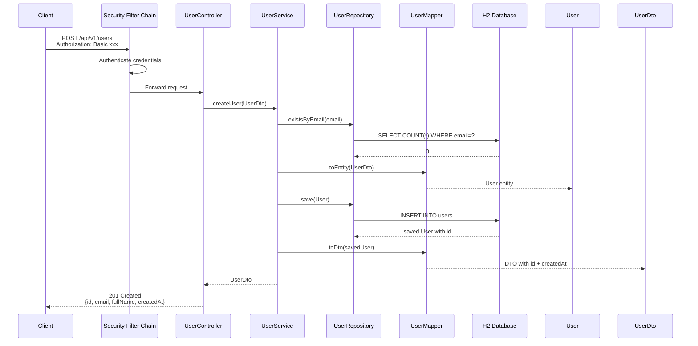
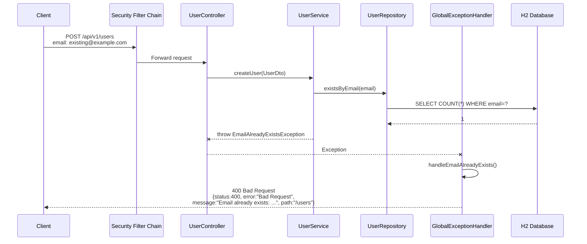
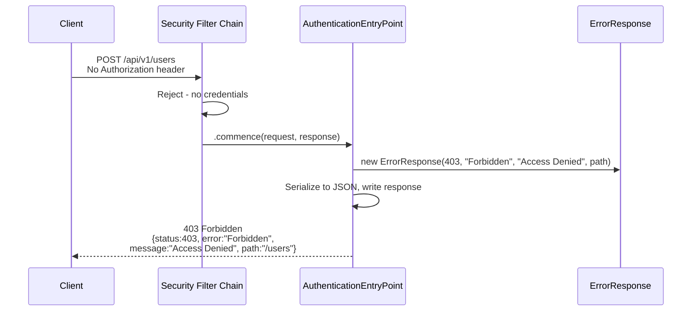
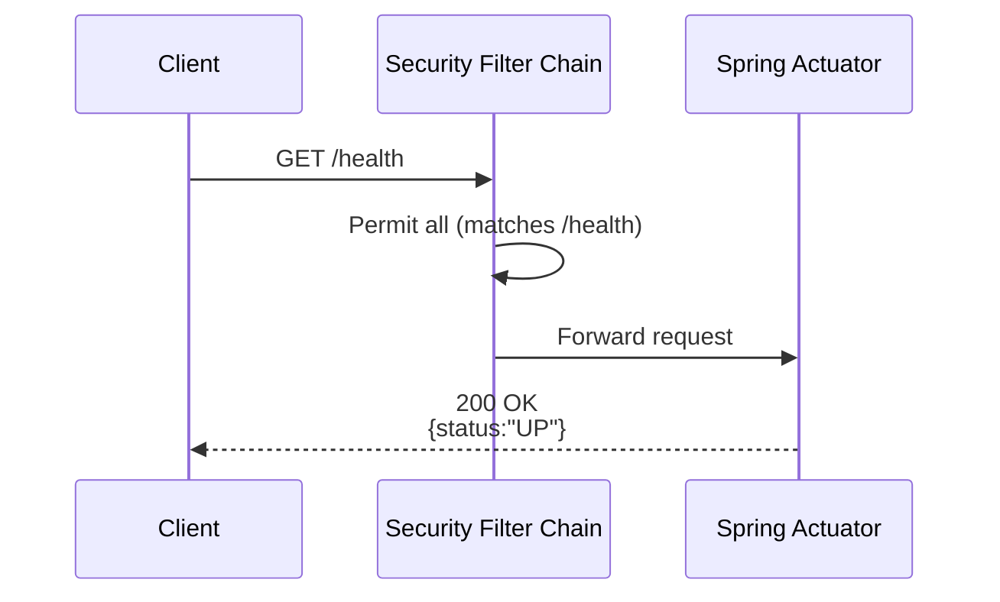
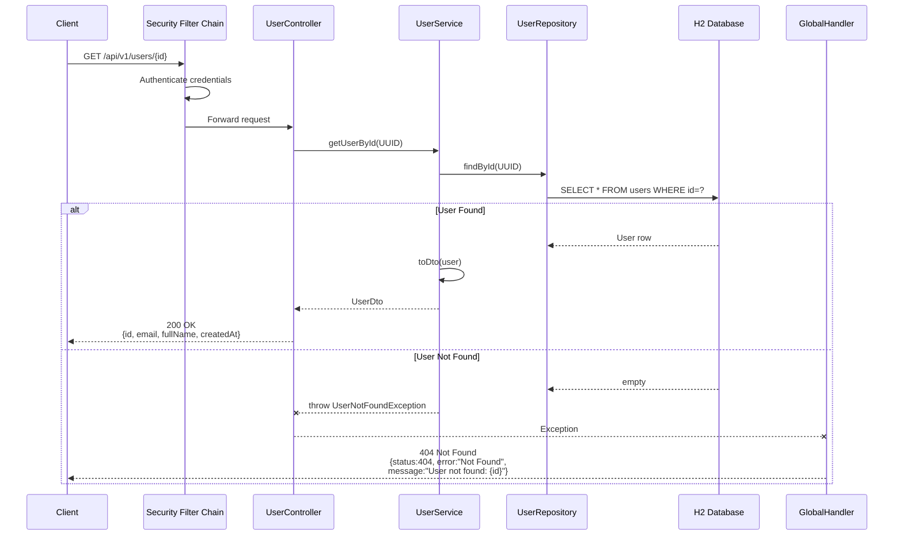
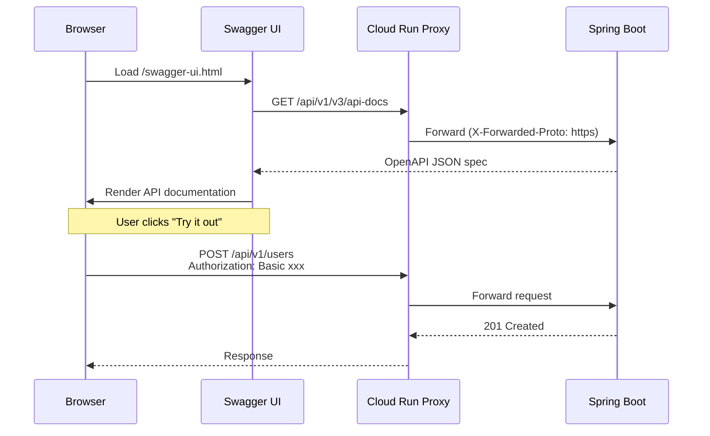

# Sequence Diagrams

## POST /api/v1/users (Authenticated)

## POST /api/v1/users - Duplicate Email

## POST /api/v1/users - Unauthenticated

## GET /health (Public)

## GET /api/v1/users/{id}

## Swagger UI Request (Cloud Run)

